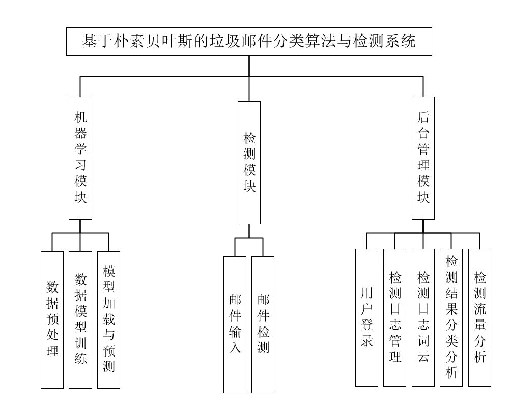
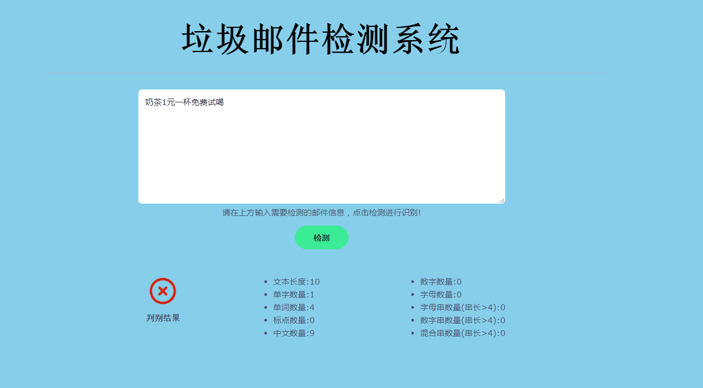
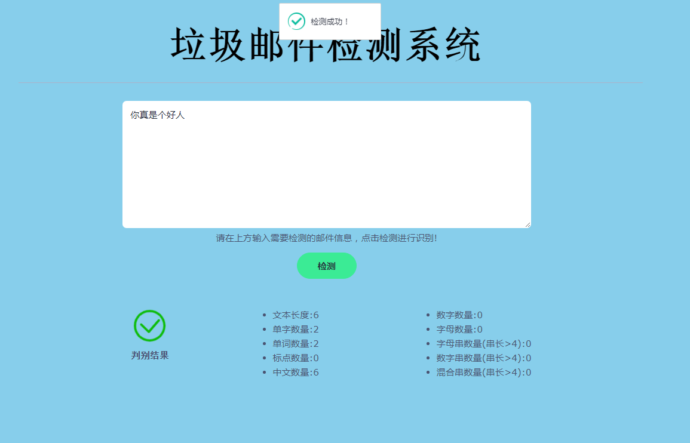
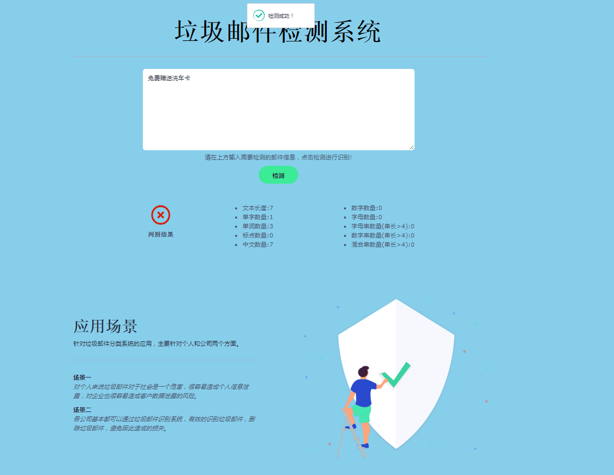
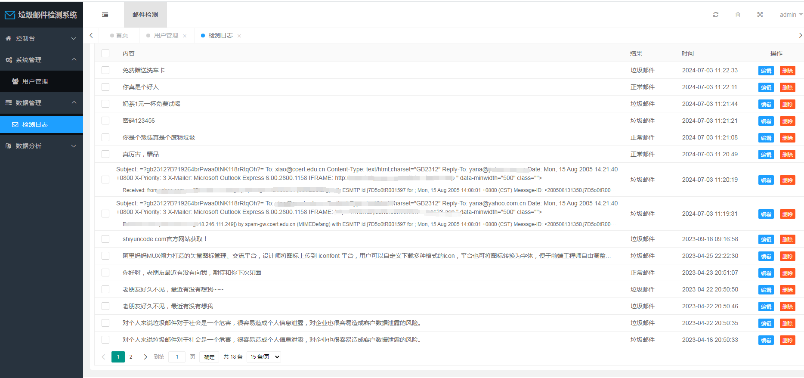
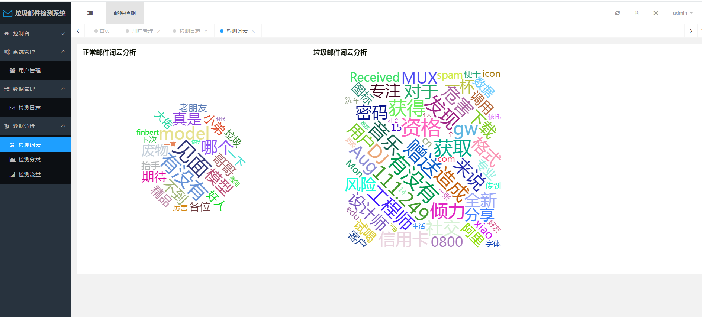
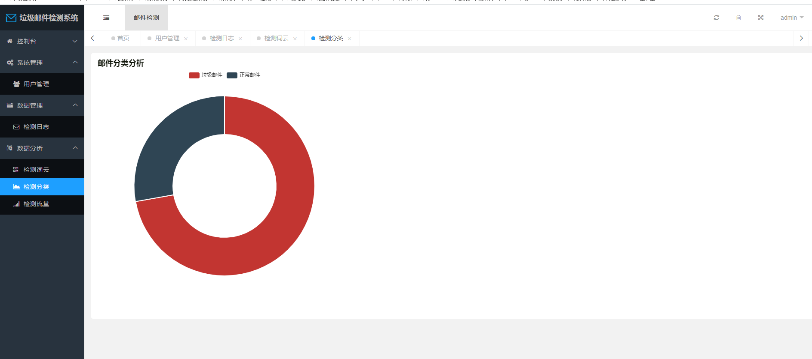
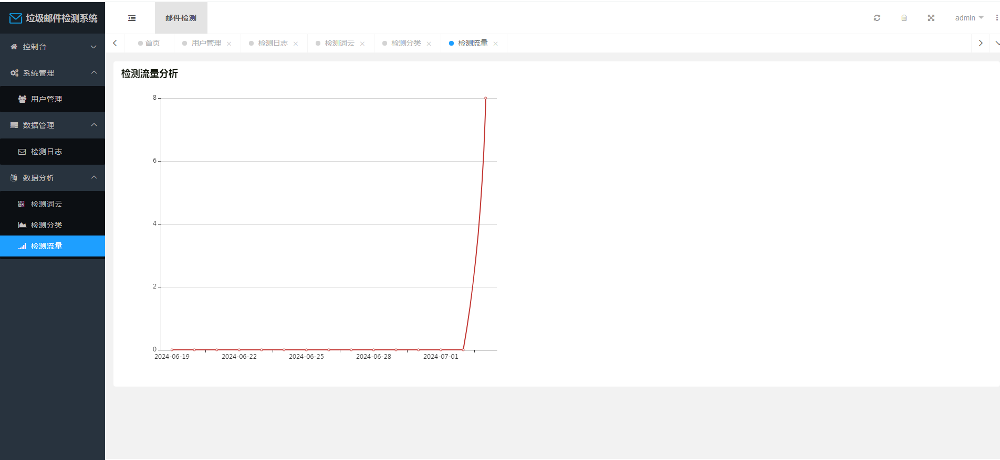

## 计算机毕业设计Python深度学习垃圾邮件分类检测系统 朴素贝叶斯算法 机器学习 人工智能 数据可视化 大数据毕业设计 Python爬虫 知识图谱 NLP文本分类 KNN卷积神经网络

## 要求
### 源码有偿！一套(论文 PPT 源码+sql脚本+教程)

### 
### 加好友前帮忙start一下，并备注github有偿纯python邮件分类
### 我的QQ号是2827724252或者798059319或者 1679232425或者微信:bysj2023nb 或bysj1688

# 

### 加qq好友说明（被部分 网友整得心力交瘁）：
    1.加好友务必按照格式备注
    2.避免浪费各自的时间！
    3.当“客服”不容易，repo 主是体面人，不爆粗，性格好，文明人。
	
### 论文
一、项目简介
随着信息时代的快速发展，电子邮件作为人们日常沟通的重要方式也变得日益普及。然而，随之而来的垃圾邮件问题不可避免地困扰着用户，对邮件通信质量造成负面影响。为了解决这一问题，我们开发了基于朴素贝叶斯算法和TF-IDF特征提取的邮件分类系统。
技术方面，我们借助Python编程语言和Sklearn、Flask、Echarts等库与框架，构建了这个功能强大的系统。朴素贝叶斯算法被选作核心分类算法，通过Sklearn库实现模型训练和分类，以提高系统的准确性。TF-IDF算法用于邮件特征提取，进一步优化了分类性能。
系统功能包括邮件检测与数据管理两大模块。邮件检测模块通过朴素贝叶斯算法和TF-IDF特征提取，对邮件进行准确分类，解决了垃圾邮件的问题。数据管理模块涵盖了数据存储、分析和可视化，通过Echarts库将检测日志内容以词云、分类饼状图和流量折线图的形式进行可视化展示，使用户能够直观了解邮件流量和分类情况。
这个系统的意义在于为用户提供了一个高效、智能的垃圾邮件分类解决方案。通过朴素贝叶斯算法，我们可以在海量的邮件中迅速准确地筛选出垃圾邮件，提升了邮件通信质量，释放了邮箱存储空间。同时，数据分析和可视化功能让用户能够更好地了解邮件流量和分类情况，为邮件管理提供了有力的支持。这样的系统符合现代社会信息化发展的趋势，对个人、企业和社会都具有积极的意义。
二、开发环境
开发环境	版本/工具
PYTHON	3.6.8
开发工具	PyCharm
操作系统	Windows 10
内存要求	8GB 以上
浏览器	Firefox (推荐)、Google Chrome (推荐)、Edge
数据库	MySQL 8.0 (推荐)
数据库工具	Navicat Premium 15 (推荐)
项目框架	FLASK、Skite-learn
三、项目技术
Python： 作为开发语言，用于编写后端逻辑和数据处理。
Flask： Python的Web框架，用于搭建后端数据接口和处理HTTP请求。
PyMySQL： 用于Python与MySQL数据库的交互，实现数据的存储和读取。
Echarts： JavaScript的数据可视化库，将数据转化为图表形式展示给用户。
LAYUI： 轻量级前端UI框架，用于构建用户友好的交互界面。
JavaScript： 用于实现前端交互和处理用户输入。
HTML和CSS： 用于构建前端界面和样式设计。
scikit-learn、pandas和numpy： Python的数据处理和机器学习库，用于数据预测和分析。
AJAX： 用于实现前后端数据交互，异步请求后端数据接口。
MySQL： 数据库管理系统，用于持久化数据。
四、功能结构
系统功能结构图

### 演示视频
https://www.bilibili.com/video/BV1Z6421Z7LP/?spm_id_from=333.999.0.0

### 运行截图

 

基于朴素贝叶斯的邮件分类系统设计

摘要：为了解决垃圾邮件导致邮件通信质量被污染、占用邮箱存储空间、伪装正常邮件进行钓鱼或诈骗以及邮件分类问题。应用Python、Sklearn、Echarts技术和Flask、Lay-UI框架，使用MySQL作为系统数据库，设计并实现了基于朴素贝叶斯算法的邮件分类系统，并以Web形式部署在本地计算机。运用Sklearn库对KNN算法、SVM算法和朴素贝叶斯算法进行建模和训练，将训练结果进行分析和对比得出朴素贝叶斯算法在准确率、召回率和精确率三个指标下比其他分类算法更适合邮件分类，因此选择朴素贝叶斯算法作为系统核心算法。系统功能包括邮件检测与数据管理两大核心模块，邮件检测模块，采用基于朴素贝叶斯算法，使用TF-IDF算法对邮件进行特征提取并将邮件内容以及检测结果存储于MySQL数据库，存储到MySQL中的数据将用于数据管理模块；数据管理模块包括数据存储、数据分析、数据可视化。系统采用黑盒测试方法对两个模块进行功能性测试，测试结果符合预期。系统满足设计基本需求，能安全、稳定和可靠地运行。
关键词：邮件分类；贝叶斯算法；MySQL；特征词提取
Design of mail classification system based on Naive Bayes
Abstract: In order to solve the spam resulting in mail communication quality pollution, occupy mailbox storage space, camouflage normal mail for phishing or fraud and mail classification problems. The mail classification system based on naive Bayes algorithm is designed and implemented by using Python, Sklearn, Echarts technology, Flask, Lay-UI framework and MySQL as the system database, and is deployed on the local computer in the form of Web. Sklearn was used to model and train KNN algorithm, SVM algorithm and naive Bayes algorithm, and the training results were analyzed and compared. Through comparison, it was concluded that naive Bayes algorithm was more suitable for mail classification than other classification algorithms under the three indexes of accuracy, recall rate and accuracy rate. Therefore, naive Bayes algorithm was chosen as the core algorithm of the system. The system functions include two core modules: mail detection and data management. Mail detection module, based on naive Bayes algorithm, uses TF-IDF algorithm to classify mails and store mail contents and detection results in MySQL database. Data stored in MySQL will be used in data management module. The data management module includes data storage, data analysis and data visualization. System uses black box test method to perform functional test on the two modules, and the test results are in line with expectations. The system meets the basic design requirements and can run safely, stably and reliably.
Keywords: Mail classification; Bayesian algorithm; MySQL; Feature word extraction

目  录

1 绪论	1
1.1 项目背景	1
1.2 国内外现状	1
1.3 项目意义	2
2 邮件预处理技术	2
2.1 邮件内容解析	2
2.2 文本分词技术	2
2.3 特征词提取技术	3
2.4 小结	5
3 常用邮件分类算法	5
3.1 KNN算法	5
3.2 支持向量机(SVM)	6
3.3 朴素贝叶斯算法	8
3.4 邮件分类算法评估及分类算法选择	8
4 基于朴素贝叶斯算法邮件分类系统需求分析	14
4.1 系统可行性分析	15
4.2 功能性需求分析分析	14
5 基于朴素贝叶斯算法邮件分类系统设计	16
5.1 系统总体设计	16
5.2 数据库设计	19
6 系统功能实现	21
6.1 后端功能模块实现	22
6.2 前端功能模块实现	28
6.2 系统检测信息可视化以及邮件内容分析	30
7 系统测试	32
7.1 测试方法	32
7.2 测试用例	33
8 结论	34
致谢	34
参考文献 	35

1 绪论
1.1 项目背景
随着互联网技术的普及与应用，现今拥有各种各样的网络通讯工具，邮件作为比较正式的网络通讯工具，被互联网用户广泛的使用着，同时邮件也具有操作便利、费用低廉、速度快捷等特点，但是邮件为人们带来便利的同时，也带来了种种负面影响。人们时常会收到一些无用的推销邮件，以及散布虚假信息、反动和色情信息，甚至还有包含病毒的邮件，需要花费大量的精力和时间来清理这些垃圾邮件，这给日常生活带来了麻烦，消耗了大量的网络资源和存储空间，为社会带来了比较大的危害[1]。
1.2 国内外现状
中国互联网协会定义垃圾邮件：未经用户许可发送同时发送给大量用户，影响正常网络通信；含有恶意的、虚假的、伪装的邮件发信人等信息。2003年2月26日，中国互联网协会颁布的《中国互联网协会垃圾邮件对策规范》第3条规定：收件人事先未提出要求或不同意接收的广告、电子刊物、各种形式宣传物等宣传性电子邮件；收件人无法拒绝的电子邮件；隐藏发送者身份、地址、标题等信息的电子邮件；包含假信息源、发送者、路由等信息的电子邮件。垃圾邮件的危害主要有以下五个方面。
（1）降低通信服务质量：占用网络带宽，造成邮件服务器堵塞，降低整个网络的运营效率。
（2）干扰了人的正常工作生活，垃圾邮件耗费收件人的时间、精力。
（3）被少数别有用心的人利用邮件的便利性以及隐蔽性广泛散播虚假有害信息，严重危害社会稳定。
（4）有些钓鱼邮件具有隐蔽性和危险性，不认真审查就会泄露信息，继而被不法分子进行电信诈骗，泄露机密信息等不法行为，严重影响社会稳定。
（5）影响LSP的服务形象，发送较多的垃圾邮件的主机会被国际反垃圾阻止列入黑名单，导致该主机访问网站或者发送邮件受到限制[2]。
从2020年到2023年期间，有关于邮件分类的研究主要关注以下四个方面：
（1）深度学习在邮件分类中的应用：随着深度学习技术的不断发展和应用，越来越多的研究者开始尝试将其应用于邮件分类领域。这种新型算法可以自动提取特征，对大规模数据进行训练，从而提高了分类精度。
（2）较少监督的邮件分类方法：监督学习方法需要大量标记好的数据作为训练集，但很多情况下难以获得足够的标记数据。因此，较少监督的或无监督的邮件分类方法逐渐成为研究热点。例如，基于主题模型、协同分类等方法，可以利用已有的少量标记数据和大量未标记数据进行分类。
（3）多语言邮件分类：随着全球化的加速，越来越多的邮件涉及多种语言，使得多语言邮件分类成为重要的问题。近年来，一些研究者提出了针对多语言邮件分类的方法，如通过跨语言知识迁移、多语言文本嵌入等方式解决多语言分类问题。
（4）针对特定领域邮件分类：随着各行业的快速发展，不同领域的邮件也呈现出多样化的特点。因此，在邮件分类研究中，针对特定领域的邮件分类也成为了一个热点问题。例如，针对医疗、法律等特定领域的邮件分类研究逐渐增多[3]。
综上所述，从2020年到2023年期间，邮件分类的研究主要关注于深度学习的应用、较少监督的方法、多语言和特定领域邮件的分类等问题，这些研究成果可以为系统设计提供更加精准和高效的邮件分类技术。
1.3 项目意义
基于上述邮件分类项目的背景介绍，实现邮件分类系统不但能够解决邮件分类问题，节省更多的人力资源，提高用户的工作效率，而且可以避免垃圾邮件对用户带来的骚扰。接下来将结合邮件预处理技术以及邮件分类算法，实现邮件分类系统。
2 邮件预处理技术
在进行垃圾邮件识别之前，我们首先需要对邮件数据进行预处理。预处理步骤包括文本分词、去除停用词、词干提取等。接下来介绍邮件内容组成以及三种文本分词技术和五种特征词分类算法。
2.1 邮件内容解析
因为电子邮件在传输过程中需要进行编码，以便于网络传输和存储，所以解析电子邮件需要解码，电子邮件数据的解码过程分为两个过程：
ASCII解码：将8位二进制数转换成对应的字符。
Base64解码：将Base64编码后的文本转换成二进制数据。Quoted-printable解码：将“=”加上其十六进制编码转换成对应的字符。需要注意的是，邮件内容的编码方式和解码方式需要同时使用，才能正确地还原邮件内容。
2.2 文本分词技术
文本分词是一种自然语言处理技术，用于将自然语言文本分解成具有实际含义的单词或符号序列，称为词汇项。文本分词是邮件分类系统中重要的一个环节，对系统有很大的影响。分类方法一般分为两类：英文分词和中文分词[4]。
常见的文本分词技术包括基于规则的方法和基于统计学习的方法。基于规则的方法使用一组预定义规则，例如词典和语法规则，来将文本分解成单词和短语。这种方法的局限性在于需要手动添加规则，并且在面对复杂和未知的情况时效果不佳。
现在对中文分词的方法主要有三种方法：正向最大匹配法、全切分法和基于词频分词法。下文就这三种中文分词方法的原理和特点进行简单的介绍和举例说明。
2.2.1 正向最大匹配法
正向最大匹配法的基本原理是：是从左到右扫描待分词的文本，每次取文本的前面一段最长的词作为切分出的词，然后将这个词从待分词文本中去掉，继续对剩下的文本进行切分，直到文本全部被切分为止[5]。其中最大匹配指的是每次选择的词具有最长的匹配长度。
对于正向最大匹配法来说可以举一个例子来说明：
假设有一个文本串“我喜欢吃巧克力”以及一个简单的词典{我，喜欢，吃，巧克力}。
从句子开头开始匹配，首先匹配到的是“我”。因为“我”是一个词，所以匹配成功。
匹配完第一个词之后，继续从“我”的下一个字符开始匹配。此时匹配到的是“喜”。
“喜”不是一个完整的词，所以需要往后继续匹配。继续匹配下一个字符，此时匹配到的是“欢”。
继续往后匹配，此时匹配到了“喜欢”。因为“喜欢”是一个词，所以匹配成功。
继续匹配下一个字符，此时匹配到了“吃”。因为“吃”是一个词，所以匹配成功。
继续匹配下一个字符，此时匹配到了“巧”。
因为“巧”不是一个完整的词，所以需要继续往后匹配。匹配下一个字符，此时匹配到了“克”。
继续匹配下一个字符，此时匹配到了“力”。因为“巧克力”是一个词，所以匹配成功。
到达句子末尾，匹配结束。
根据以上示例，正向最大匹配法的基本流程就是在文本串中从左往右匹配出最长的词，并将其切分出来。这种方法简单易行，但也有一些局限性，例如无法处理歧义问题和新词问题等。
2.2.2 全切分法
全切分法的基本思想是：将待分词的文本中的所有可能的切分方式都进行尝试，从中选择最合适的一种切分方式作为最终的分词结果。具体来说，全切分法会对待分词文本进行递归切分，将文本从左到右依次分成不同的子串，然后对每个子串进行判断，如果是一个词，则将其加入分词结果中，否则将其继续递归切分，直到全部的子串都被切分为止。全切分法的优点是能够保证分词的准确性，但是由于需要考虑所有可能的切分方式，所以速度较慢，不适用于大规模文本的分词[6]。
2.2.3 基于词频分词法
词频分词法的基本思想是：通过统计的方法计算相邻字出现的频率来表示他们的互信息，当他们的频率超过某个阈值时，就把这两个字当成一个词，然后把这些词的词频相乘从而得到最后结果。这种方法复杂度比较高，而且低频词的错误难以克服。
2.3 特征词提取技术
将邮件文本内容经过分词处理后，提取出来的词的数量比较大，如果将这些词全部用作特征，特征向量的维数仍然比较大，可以通过对特征项作进一步的选择和提取，得到贡献比较大的特征集，来提高分类系统的运行速度和程序效率。特征词提取技术是文本挖掘领域的一种重要技术，可以从文本中自动提取出具有代表性或区分性的关键信息，以帮助计算机更好地理解和处理文本。现在常用的特征提取方法有以下五种。
2.3.1 TF-IDF(词频．倒排词频)法
该方法的基本原理是：TF（Term Frequency）：词频指的是在一个文档中某个词出现的次数，TF值越高表示该词在文档中的重要性越高。IDF（Inverse Document Frequency）：逆文档频率指的是一个词在整个文集中出现的频率，IDF值越高表示该词在整个文集中的重要性越低。TF-IDF：将TF和IDF相乘得到一个词的TF-IDF值，表示该词在文档中的重要性，同时考虑了该词在整个文集中的重要性。应用：TF-IDF可以用于文本分类、关键词提取、相似度计算等任务，通过计算文档中每个词的TF-IDF值，可以找到最相关的文档或者提取出最重要的关键词[7]。公式如下
TF-IDF(T)= ㏒(TF(T)/IDF(T))
2.3.2 互信息
互信息（Mutual Information）是一种用于度量两个随机变量之间相关性的方法。在自然语言处理领域中，互信息常用于词语的特征选择、文本分类和信息检索等任务中。
对于两个随机变量X和Y，它们之间的互信息I(X;Y)定义为它们联合概率分布与各自边缘概率分布的乘积之比的对数：

其中，P(X,Y)表示X和Y同时发生的概率，P(X)和P(Y)分别表示X和Y各自发生的概率。当两个随机变量相互独立时，它们的互信息为0。
在文本挖掘中，可以将语料库看作一个大型的随机变量集合，每个单词或短语是一个小型随机变量。通过计算不同单词之间的互信息，可以找出哪些是最能区分不同类别文本的特征词。通常，在计算互信息时，需要对次数非常少的共现事件进行平滑处理，避免出现0概率的情况。
互信息是一种常用的特征选择方法，其优点在于可以考虑到特征之间的相关性，能够比较准确地挖掘出与目标任务相关的特征。
2.3.3 信息增益
信息增益是一种用于特征选择的方法，它能够针对每个特征计算出其对于分类任务所提供的信息量大小。在决策树等机器学习算法中，需要选择最好的特征来做为分裂节点，使得分裂后的子集尽可能地纯净。
具体地说，信息增益是指通过划分数据集，获得的关于样本类别的新信息量。在信息论和统计学中，熵是衡量随机变量不确定度的一个指标。在分类任务中，一个属性的信息增益就等于使用这个属性进行分类所能够获得的熵的减少量。因此，可以通过比较不同特征的信息增益大小，来选择最好的特征。
信息增益的公式定义如下：

其中：P(T)表示特征词T不出现的概率，表示在特征词T发生的条件下文本属于类Ci的概率，P(C|T)表示在特征词T不发生的条件下文本属于类的概率。
2.3.4 基于文档频度特征选择算法 
基于文档频度的特征选择算法是一种常用的特征选择方法，其基本原理是根据每个特征（如单词、短语等）在不同文档中出现的频率进行统计和比较，来确定哪些特征更具有代表性和区分度。这种算法通常会对一组文档进行分析和处理，在所有文档中筛选出那些与预测分类或聚类最相关的特征。
一个简单的例子是，假设要对几篇新闻文章进行情感分析，包括正面、负面和中性三种情感，其中每篇文章都包含许多单词。为了确定哪些单词最能够代表文本的情感倾向，可以先统计各个单词在所有文章中出现的词频（即文档频度），并计算它们在正、负、中性文章中出现的频率。如果某个单词在正面文章中出现的概率明显高于在负面和中性文章中出现的概率，那么就可以认为这个单词更可能表示正面情感。通过筛选出一些高频次、代表性强的单词，就可以有效地提高分类器的准确率和鲁棒性。
2.3.5 基于分布特征词选择算法
基于分布的特征词选择算法的基本原理是：假设特征词T和文档类别C之间符合一阶，通过计算特征词T和文档类别C之间的相关程度来进行特征词的选择。特征词和文档类别之间的相关性的分布定义为：

其中：N代表所有文档，N(，T)代表属于类别且包含特征词T的文档数，N(C，T)表示即不包含特征词T，也不属于类别的文档，N(T，)表示包含特征T，但不属于类别的文档，N(T，)表示不包含特征T，但属于类别的文档。基于分布的特征词选择算法的主要优点有：
（1）能够挖掘具有代表性和区分能力的特征词，避免了无效信息的影响。
（2）该算法对于文本分类任务来说十分简单且有效，能够提高文本分类器整体的分类精度。
（3）算法计算速度相对较快，适用于处理较大的文本数据集。
同时，基于分布的特征词选择算法也存在一些缺点：
（1）算法依赖于数据集和分类器的实现，需要对算法做适当调整以获得较好的性能。
（2）对于某些情况下取值过少的特征词，卡方检验结果可能会不准确。
（3）该算法无法处理新增特征词的情况，需要重新计算。
2.4 小结
上面介绍了三种文本分词技术和五种分类算法都各有各的特点，经过对五种特征词处理算法的比对，TF-IDF算法更加简单并且基于词频的统计方法更适合邮件分类，所以系统采用TF-IDF方法为主要的特征词提取算法。
3 常用邮件分类算法
邮件分类问题大部分可以转换为文本分类问题，现在常用的文本分类算法大部分有三种，分别为KNN算法、SVM算法以及朴素贝叶斯算法，接下来对这三种算法进行介绍，并进行建模以及性能分析。将使用三种指标对其进行性能分析，在其中使用最适合的算法作为邮件分类系统的核心算法。
3.1 KNN算法
KNN算法（K近邻算法）：KNN算法是基于实例的非参数化机器学习算法之一，通过计算样本之间的相似性来进行分类或回归预测。KNN算法的基本思想是，对于一个新的数据点，根据它与已知数据集中各个点的距离，找出距离最近的K个邻居，并根据这些邻居的标签确定该新数据点的分类[8]。
图1  KNN算法演示
KNN算法如图1所示，有两种不同的样本数据，分别用小正方形和小三角形表示，图的中间用圆表示的数据是被分类的数据。
然后根据K近邻思想对圆进行分类。如果K=3离圆最近的三个点是两个三角形和一个正方形，少数服从多数，根据统计方法，判定圆的这个分类点属于三角形的一种。在K=5的情况下，绿色点最近的五个邻居是两个三角形和三个正方形，或者少数服从多数，根据统计方法确定绿色的这个待分类点属于正方形类。
KNN算法的主要优点有：
（1）理论成熟，思想简单，将其算法作为回归使用或是分类使用都是不错的选择，易于理解实现。
（2）可用于非线性分类。
（3）KNN算法训练时间复杂度低于SVM之类的算法。
（4）较朴素贝叶斯之类的算法，对数据无假设、精度高、对异常点不敏感。
KNN的主要缺点：
（1）计算量大，特别是特征数非常多的情况。
（2）样本不平衡的情况下，稀有类别的预测精度低。
（3）KD树、球树等的模型构筑需要大量的存储器。
（4）无力的学习方法，因为基本上不学习，所以预测时间的速度比逻辑回归等算法慢。
（5）使用非常依赖于数据的表示方式。
3.2 支持向量机(SVM)
支持向量机（Support Vector Machine，SVM）是一种常见的监督学习方法，用于分类和回归分析。其基本思想是找到一个最优的超平面，将不同类别的数据点尽可能地分开，并且能够对未知的数据进行准确的分类或预测。
在支持向量机算法中，最关键的部分就是找到最优的超平面。这个过程可以通过数学优化来实现，其中需要根据训练数据集的特征向量进行计算，以确定最佳的分割边界。通常情况下，使用核函数扩展特征空间，可以将非线性分类问题转换为线性分类问题，进而应用支持向量机算法。
图2  SVM算法
SVM算法如图2所示。SVM算法在决定最佳超平面时只有支持向量起作用，而其他数据点并不起作用。如果移动非支持向量，删除不支持的向量不会影响最佳超平面。即支持向量对模型起决定性作用这也是“支持向量机”名称的由来。
SVM算法的主要优点是：
（1）可以处理高维度的数据：在高维度数据中找到最优超平面是一项相对容易的任务，而支持向量机算法能够有效地完成这个任务，避免了“维数灾难”的问题。
（2）鲁棒性强：因为SVM算法优化的是间隔，而不是分类准确率，所以其对于噪声和异常值的鲁棒性较强。因此，在存在一定数量噪声或异常值的数据集上，SVM算法也可以取得较好的分类效果。
（3）易于扩展：通过选择不同的核函数，可以将线性不可分的问题转换成线性可分的问题，从而允许SVM算法处理更广泛的问题类型。
（4）泛化能力强：支持向量机算法通过最小化结构风险而不是经验风险来实现学习，从而可以提高算法的泛化能力，即对未知样本的预测效果较好。
SVM算法的主要缺点是：
（1）对参数设置和核函数的选择较为敏感：对于不同的数据集，需要选择不同的核函数和参数。特别是在处理非线性问题时，不同的核函数可能会产生不同的分类结果。
（2）算法需要大量的计算资源和时间：支持向量机算法在确定最优超平面时需要进行复杂的数学优化，这个过程通常比较耗时，并且需要大量的计算资源。
（3）可解释性差：由于模型的复杂度较高，支持向量机算法很难被解释清楚其内部的工作原理，导致模型的可解释性比较差。
（4）处理多类别问题困难：SVM本身是一个二元分类器，对于多类别问题需要进行特殊处理。
（5）对噪声敏感：SVM算法针对间隔最大化的优化过程存在一定的噪声敏感度，因此，对于数据噪声比较大的情况表现可能不如其他方法。
综上所述，支持向量机算法缺点包括对参数设置以及核函数的选择敏感、需要大量的计算资源和时间、可解释性差、处理多类别问题困难和对噪声敏感等，这些缺点需要在使用SVM算法时认真考虑和处理，避免出现不良影响。

3.3 朴素贝叶斯算法
贝叶斯判定准则；要最小化总体风险，只需为每个样本选择最小化风险的类别标记。
贝叶斯定理的名词解释:

条件概率P(X|C)表示样本x在分类c下出现的概率，但很多样本在训练集根本没有出现，所以不能直接用频率来估计概率。
拉普拉斯修正：
若某个属性值在训练集中没有与某个类同时出现过，则训练后的模型会出现过拟合现象，为了避免其他属性携带的信息，被训练集中未出现的属性值“抹去”，在估计概率值时通常要进行“拉普拉斯修正”：

N表示训练集D中可能的类别数，表示第i个属性可能的取值数。
朴素贝叶斯算法的优点包括：
（1）算法简单、易于实现和理解，计算效率高。
（2）在处理大规模数据集时具有较好的效率和可扩展性。
（3）对于高维数据集，朴素贝叶斯算法表现良好。
（4）对于分类问题，朴素贝叶斯算法可以处理多分类问题，并且能够处理多类别和连续特征。
（5）对于缺失数据的情况，朴素贝叶斯算法可以有效地处理缺失数据。
（6）对于噪声数据，朴素贝叶斯算法具有较好的鲁棒性。
（7）对于小规模数据集，朴素贝叶斯算法表现也很出色。
朴素贝叶斯算法的缺点包括：
（1）假设特征之间相互独立，这在实际应用中并不总是成立，因此可能会影响分类效果。
（2）对于输入数据的准备要求较高，需要对数据进行预处理和特征提取。
（3）对于数据中的噪声和异常值比较敏感，可能会影响分类效果。
（4）朴素贝叶斯算法是一种基于概率的分类方法，对于非概率模型的问题，可能表现不佳。
（5）在处理文本分类等问题时，由于词汇表很大，需要大量的存储空间和计算资源。
（6）在处理连续变量时，需要对数据进行离散化处理，这可能会导致信息损失。
（7）朴素贝叶斯算法的分类效果受到先验概率的影响，先验概率不准确，导致分类结果不准确。
3.4 邮件分类算法评估及分类算法选择
基于以上介绍的三种算法，接下来对三种算法进行建模和训练评估。最后选择出最适合的算法作为核心算法使用。
3.4.1 数据集介绍
本数据集来自国际文本信息检索会议（TREC，Text Retrieval Conference）中的TREC06c数据集，其中共12924条，其中选取2000封邮件样本作为训练集，500封邮件样本作为测试集。邮件样本是纯文本格式，邮件头也是文本格式，数据处理需要去除邮件头保留正文内容。本文在其中选择部分数据用来进行实验[9]。
3.4.2 模型评价指标
评估垃圾邮件过滤的效果，常用的评判标准有4个：准确率、精确率、召回率、F1值。本文采取召回率、查准率、准确率作为本实验的3个评价指标。以分类规则：TP预测为正实际为正，FP预测为正实际为负，TN预测为负实际为负，FN预测为负实际为正，TN预测为负实际为负。分类规则表如表1。
表1  分类规则表
总样本	分类为正例	分类为负例
正样本率	TP	FN
负样本率	FP	TN
准确率表示分类器识别正确的比例是一个很好的很直观的评价标准，一般情况下，准确率越高就代表分类效果越好，但是当训练数据样本量不平衡的时候，准确率的参考价值不大，所以单靠准确率来评价一个算法模型是远远不够科学全面的。

精确率表示分类器对邮件进行分类后检测到的所有垃圾邮件中所占的比例，侧重安全性。

召回率表示分类检测是垃圾邮件中垃圾邮件所占的比例，侧重于有效性。

本次分类算法评估使用上一节所介绍的算法，分别为KNN算法、支持向量机（SVM）算法、朴素贝叶斯算法。
3.4.3 KNN算法建模以及模型训练
KNN算法主要采用基于Sklearn库中的sklearn.neighbors.KNeighborsClassifier()函数选取k值，就是暴力法计算输入实例到每一个训练实例的距离，然后取前k个距离最短的采取多数表决规则进行分类。为了提高k近邻的搜索效率，可以考虑使用特殊的结构存储训练数据，以减少距离计算的次数，常用的有kdtree方法。关键参数“weights”：用于标识每个样本的近邻样本的权重，可选择“uniform”，“distance”或自定义权重。默认“uniform”，所有最近邻样本权重都一样。如果是“distance”，则权重和距离成反比例；“leaf_size”：这个值控制了使用kd树或者球树时，停止建子树的叶子节点数量的阈值。这个值越小，则生成的kc树或者球树就越大，层数越深，建树时间越长，反之，则生成的kd树或者球树会越小，层数较浅，建树时间较短。默认是30。KNN算法建模参数如图3。

图3  KNN算法建模参数
设定参数后将模型进行导入，模型导入后进行训练数据集的导入以及模型训练。该分类器算法的参数为默认参数，为了能够更准确的进行算法对于邮件分类性能的对比，所有训练集和测试集均相同。图4为训练集导入图，图5为KNN算法训练代码图，图6为KNN算法训练结果指标图。
图4  训练集导入
图5  KNN算法训练代码
图6  KNN算法训练结果指标
3.4.4 SVM算法建模以及模型训练
SVM算法采用Sklearn库中SVM模块进行训练，该模块提供了7个常用类，这些不同的类分别应用了不同的核函数，因此它们可以解决不同的问题，比如分类问题、回归问题以及无监督学习中的异常点检测等。基于本系统的应用，使用该模块的LinearSVC类进行模型训练。关键参数“C”为惩罚系数，用来控制损失函数的惩罚系数，类似于LR中的正则化系数，默认值为1.0。“C”越大，即对分错样本的惩罚程度越大，因此在训练样本中准确率越高，但是泛化能力降低，也就是对测试数据的分类准确率降低。相反，减小“C”的话，容许训练样本中有一些误分类错误样本，泛化能力强。对于训练样本带有噪声的情况，一般采用后者，把训练样本集中错误分类的样本作为噪声。“multi_class”：负责多分类问题中分类策略制定，有“ovr”和“crammer_singer”两种参数值可选，默认值是“ovr”，“ovr”的分类原则是将待分类中的某一类当作正类，其他全部归为负类，通过这样求取得到每个类别作为正类时的正确率，取正确率最高的那个类别为正类；“crammer_singer”是直接针对目标函数设置多个参数值，最后进行优化，得到不同类别的参数值大小。算法建模参数代码图如下。“loss”：损失函数，有“hinge”和“squared_hinge”两种可选，前者称为L1损失，后者为L2损失，默认是“squared_hinge”，其中“hinge”是SVM的标准损失，“squared_hinge”是“hinge”的平方。图7为SVM算法建模参数图。
图7  SVM算法建模参数
设定参数后将模型进行导入，模型导入后进行训练数据集的导入以及模型训练。该分类器算法的参数为默认参数，为了能够更准确的进行算法对于邮件分类性能的对比，所有训练集和测试集均相同。图8为训练数据集导入图，图9为SVM算法训练代码图，图10为SVM算法训练评估结果图。
图8  训练数据集导入
图9  SVM算法训练代码
图10  SVM算法训练评估结果
3.4.5 朴素贝叶斯算法建模以及模型训练
朴素贝叶斯算法同样采用Sklearn库导入朴素贝叶斯模型进行训练，使用Jieba库进行中文分词，TF-IDF算法进行词频统计，因为是中文邮件分词需要使用正则表达式过滤非中文词，所有使用re依赖包中的正则表达式过滤非中文词汇。关键参数“fit_prior”为布尔型可选参数，默认为True。布尔参数“fit_prior”表示是否要考虑先验概率，如果是False，则所有的样本类别输出都有相同的类别先验概率。否则可以自己用第三个参数“class_prior”输入先验概率，或者不输入第三个参数“class_prior”，让MultinomialNB自己从训练集样本来计算先验概率。“alpha”为浮点型可选参数，默认为1.0，添加拉普拉斯平滑。设定参数后将模型进行导入，模型导入后进行训练数据集的导入以及模型训练。该分类器算法的参数为默认参数，为了能够更准确的进行算法对于邮件分类性能的对比，所有训练集和测试集均相同。图11为贝叶斯分类器参数代码图，图12为训练数据导入代码图，图13为模型训练代码图，图14为训练结果指标图。
图11  贝叶斯分类器参数代码
图12  训练数据导入代码
图13  模型训练代码
图14  训练结果指标
3.4.6 评估结果
为了验证多种分类算法对垃圾邮件分类的性能对比，选择了KNN算法，SVM算法，朴素贝叶斯算法进行对比实验，同时采用1000封正常邮件(ham)，1000封垃圾邮件(spam)，对KNN算法，SVM算法和朴素贝叶斯算法进行分类训练，准确率、精确率和召回率均使用Sklearn库实现，准确率使用函数accuracy_score()填入训练模型矩阵结果得出该模型准确率，精确率使用函数precision_score()填入训练模型结果的稀疏矩阵得出该模型的精确率，召回率使用函数recall_score()填入训练模型结果的稀疏矩阵得出该模型的召回率，三个模型的测试评估结果汇总如表2。
表2  测试表
分类算法	判别类型	分类为正例	分类为负例	召回率	精确率	准确率
KNN	正样本	892	108	89.2%	88.49%	88.8%
	负样本	116	884			
SVM	正样本	925	75	92.5%	91.67%	87.05%
	负样本	84	816			
朴素贝叶斯	正样本	966	34	96.6%	95.83%	96.2%
	负样本率	42	958			
分别对KNN算法，SVM算法和朴素贝叶斯算法的召回率，精确率和准确率进行对比，结果表明对KNN算法使用共2000封邮件进行训练，使用500封邮件进行测试，其召回率，精确率和准确率分别为89.2%，88.49%，88.8%。对SVM算法使用共2000封邮件进行训练，使用500封邮件进行测试，其召回率，精确率和准确率分别为92.5%，91.67%，87.05%。对朴素贝叶斯算法使用共2000封邮件进行训练，使用500封邮件进行测试，其召回率，精确率和准确率分别为96.6%，95.83%，96.2%。由此可见，朴素贝叶斯算法比较KNN算法以及SVM算法在召回率、精确率和准确率上具有更为突出的表现的同时朴素贝叶斯算法也比较其他算法更加简洁便利，所以系统采用朴素贝叶斯算法作为邮件分类算法使用。
4 基于朴素贝叶斯算法邮件分类系统需求分析
确定核心算法后，接下来对基于朴素贝叶斯算法的邮件分类系统进行需求分析，分别为系统可行性分析和功能性需求分析。
4.1 系统可行性分析
(1)技术可行性分析:技术可行性方面，朴素贝叶斯算法是一种成熟的文本分类算法，已经有许多相关的开源库和工具可供使用。开发人员可以选择适合自己的编程语言和开发框架来实现该系统。同时，邮件的格式与内容相对固定，这也使得朴素贝叶斯算法可以取得较好的分类效果。同时因此，从技术角度来看，该系统的开发是可行的[10]。
(2)市场可行性分析:通过市场可行性方面，随着互联网的普及，人们越来越依赖电子邮件进行沟通和交流。邮件分类系统可以帮助用户过滤掉垃圾邮件，提高工作效率和生活质量。因此，在市场上具有一定的需求和潜在用户，该系统的开发也是有可行性的。
综上所述，基于朴素贝叶斯算法的邮件分类系统具有较高的实用性。同时各种开源框架以及算法也为系统设计提供了可行性，在性能、技术和市场方面也同样都具备可行性，可以进行开发和推广。
4.2 功能性需求分析
对于所有系统来说，需求分析是不可或缺的一部分内容，在项目开始阶段，明确项目需要完成、实现的功能以及项目目标用户需求，现在对本系统进行功能性需求分析。
（1）数据收集：
一个可靠的、全面的数据集是基于朴素贝叶斯算法的邮件分类系统的关键组成部分。该系统需要采集大量的垃圾邮件和正常邮件，并将其作为训练模型的输入。这些数据需要经过审核，以确保它们是符合实际情况的样本。此外，每个数据点都应该有正确的标签，即指示它是垃圾邮件还是正常邮件。
（2）特征选择：
为了便于计算和处理，需要选择具有代表性的特征作为训练模型的输入。这些特征可以包括单词、短语、发件人、主题等。在选择特征时，需要考虑它们的重要性、覆盖率和互不相关性。如果某些特征之间存在强相关性，则需要使用其他算法来削减冗余特征。
（3）建立模型：
采用朴素贝叶斯算法或其变种，建立分类器，并应用学习算法对数据进行训练，以使得分类器能够自行识别新邮件的类别。在该系统中，需要识别垃圾邮件和正常邮件之间的差异，并使用这些差异来构建模型。与此同时，还需要对每个特征进行计数和概率估计，以确定各特征对分类的影响程度。
（4）性能优化：
确保邮件分类系统的性能稳定，避免误判和漏判，并对大规模数据集的处理进行优化，以提高运行效率。在处理大量数据时，需要考虑内存消耗、时间复杂度和扩展性等因素。为了提高性能，可以使用多线程或分布式计算来处理数据集。
（5）用户界面和反馈机制：
为了方便用户使用，需要为系统设计一个友好的用户界面，并使用户能够方便地查询、增加、删除数据。此外，还需要设计一个反馈机制，以便用户能够及时得到与邮件分类相关的反馈信息。例如，如果用户发现某个邮件被错误地识别为垃圾邮件，则需要能够将其标记为正常邮件，并向系统管理员发送有关此类问题的报告。
基于朴素贝叶斯算法的邮件分类系统需要进行数据收集、特征选择、模型建立、性能优化、用户界面和反馈机制等方面的需求分析。在实际操作中，还需要考虑安全性、可维护性和可扩展性等问题。通过对这些问题进行仔细地分析和解决，可以确保该系统在实际使用中能够发挥最佳性能，并为用户提供便捷的服务[11]。
5 基于朴素贝叶斯算法邮件分类系统设计
确定系统需求后接下来进行系统设计，首先介绍系统设计时使用的工具，接着对系统功能结构也就是系统功能模块进行设计，最后基于系统功能模块设计合适的数据库对数据进行存储。
5.1 系统总体设计
前面详细讲解了以下设计垃圾邮件分类系统需求分析，下面根据这些需求分析来进行垃圾邮件分类系统的设计。下面是邮箱分类系统的工具及其相关技术。
5.1.1 系统工具
运行环境：Python3.6及以上；开发工具：PyChram；操作系统：Windows 10，8G内存以上；浏览器：Edge；数据库：MySQL5.7。
前端：
系统前端以HTML语言为模板制作邮件处理系统，HTML语言使用各种标签和属性定义多媒体内容，同时系统使用了CSS以及JS脚本来实现Web页面的使用。而前端的UI框架则是使用Lay-UI，该框架提供了丰富的UI组件，简洁易用的Api，所以系统采用Lay-UI进行前端Web的开发。
后端：
因为系统后端选择的语言是Python，经过综合比对，后端选择了Flask框架作为主要的Web后端，同时Flask拥有大量的第三方扩展，可以简化和第三方库的工作，所选择的数据库是MySQL，MySQL作为关系型数据库，把数据储存在不同的表中。连接数据库工具采用PyMySQL，除了基本的数据库连接和查询操作，PyMySQL还提供了一些高级特性，如事务管理、存储过程调用、SSL加密连接该工具，同时该工具可以与Python的数据处理和可视化库无缝集成，如将要使用到的Pandas、NumPy、Matplotlib库。
5.1.2 系统功能结构设计
系统架构的组成部分分别为前端UI、展示层、业务层、数据层、数据库。如图15所示。前UI使用的框架是Vue、HTML和Element框架，展示层使用GET请求获取数据，POST请求获取前端界面图片。业务层有邮件过滤、邮件查询、邮件标注业务。数据层主要使用Mybatis读写数据库，数据库采用的是MySQL作为系统数据存储。
基于朴素贝叶斯算法的邮件分类系统的系统总体设计架构包含以下组件：
数据预处理模块：该模块主要负责对原始邮件数据进行邮件处理，例如去除HTML标签、提取正文内容等，由于该数据集邮件全部为txt的格式进行储存所有只用将邮件的正文识别提取出即可，同时进行停用词的处理。数据预处理流程如图16所示。
图16  数据预处理流程
特征提取模块：该模块主要负责对预处理后的邮件数据进行特征提取，并将其转换为数值型数据以便算法能够处理。常见的特征包括单词频率、词汇多样性、邮件长度等。特征词提取算法采用TF-IDF算法，先加载停用词，再统计TF词频，再进行IDF逆词频的计算，进行数据拟合再转化为词向量，最后去除停用词得到特征词。特征提取流程如图17所示。
图17  特征提取模块流程
训练模块：该模块主要使用朴素贝叶斯算法对已标记的数据进行训练，从而得出垃圾邮件和非垃圾邮件的概率分布模型，形成统计表。在训练过程中，需要使用交叉验证和调参等技术来优化算法效果。训练模块流程如图18所示。
图18  训练模块流程
分类模块：该模块主要使用训练好的模型对待分类邮件进行分类。根据邮件的特征向量，通过朴素贝叶斯公式计算出垃圾邮件和非垃圾邮件的概率，并根据概率大小进行分类判断。流程如图19所示。
图19  分类模块流程
用户反馈模块：该模块主要负责记录用户对邮件分类结果的反馈，并将其用于优化训练模型。例如，用户可以手动标记某些被错误分类的邮件，从而提高算法的准确性，以及用户通过反馈模块提交系统错误或者界面问题，使系统能够更多的面向普通用户。系统功能模块图如图20所示。
图20  系统功能模块
5.2 数据库设计
5.2.1 数据库结构设计
图21  用户E-R图
图22  管理员E-R图
用户实体有，用户ID、用户类别、用户名、密码、公司名、邮箱、用户类型、是否启用属性，其中用户ID为主键。
日志实体有，日志ID、检测结果、检测时间属性，日志ID为主键。
版本实体有，版本ID、版本内容、版本号属性，版本ID为主键。
邮件实体有，邮件ID、邮件内容、检测结果、检测时间属性，邮件ID为主键。
5.2.2 数据库逻辑设计
由上面的E-R图可知，本系统一共有实体4个，所以整个系统一共有4张数据库表，现将每张表的设计展示如下：

表3 日志信息表
字段名	数据类型	非空	主键	注释
Id	int(11)	Y	Y	主键
Id_admin	int(11)	Y	N	外键
Create_time	datetime	Y	N	检测时间
Result	int(11)	Y	N	检测结果
表4 版本信息表
字段名	数据类型	非空	主键	注释
Id	int(11)	Y	Y	主键
Id_admin	int(11)	Y	N	外键
Content	longtext	Y	N	版本内容
Result	int(11)	Y	N	版本号
表5 邮件表
字段名	数据类型	非空	主键	注释
Id	int(11)	Y	Y	主键
Id_admin	int(11)	Y	N	外键
Content	longtext	Y	N	邮件内容
Result	int(11)	Y	N	检测结果
Create_time	datetime	Y	N	检测时间
表6 用户信息表
字段名	数据类型	非空	主键	注释
Id	int(11)	Y	Y	主键
Name	varchar(50)	Y	N	用户类别
Account	varchar(100)	Y	N	用户名
Password	varchar(20)	Y	N	密码
Company	varchar(255)	Y	N	公司名
Mail	varchar(50)	Y	N	邮箱
Type	int(11)	Y	N	用户类型
Status	int(11)	Y	N	是否启用
6 系统功能实现
经过以上的系统设计，接下来根据系统设计模块进行具体的功能模块实现，分为后端功能实现和前端功能的实现。
6.1 后端功能模块实现
对后端功能进行实现，主要分为四个模块；数据预处理模块、特征提取模块、训练模块、分类模块。以下是对功能具体实现的代码图以及说明。
6.1.1 数据预处理模块
本次数据集是国际文本信息检索会议（TREC，Text Retrieval Conference）提供，数据集名称为TREC06c。ham文件下的txt文本为正常邮件，spam文件下的txt文本为垃圾邮件。共选取9000封正常邮件，3924封垃圾邮件作为测试集测试。数据处理流程如图23所示。
图23  数据处理流程
模型导入：导入需要用到的第三方库，这次主要用到的第三方库，主要有Matplotlib、Panda、Numpy、Sklearn、Joblib、re等。本算法模型需要用到Sklearn库中的两个处理文本信息的函数CountVectorizer,TfidfVectorizer，这两个函数都是可以把文本转化为词向量的方法。关键参数“fit_prior”为布尔型可选参数，默认为True。布尔参数“fit_prior”表示是否要考虑先验概率，如果是False，则所有的样本类别输出都有相同的类别先验概率。否则可以自己用第三个参数“class_prior”输入先验概率，或者不输入第三个参数“class_prior”，让MultinomialNB函数从训练集样本来计算先验概率。“alpha”为浮点型可选参数，默认为1.0，添加拉普拉斯平滑。图24为模型导入代码，图25为分类器主要参数图。
图24  模型导入代码
图25  分类器主要参数
训练数据集导入：训练数据集选择数据集中的3000份正常邮件，2000份垃圾邮作为训练数据。训练数据处理：首先定义一个获取文件路径的函数，将index文件夹中存储的训练集路径和标签值提取出来。使split函数对训练集内容进行简单的处理分割了标记和路径，并标记spam为垃圾邮件，未被标记的则为正常邮件，根据路径打开文件，并且对训练数据集进行简单的处理，遍历训练集文件，去除训练数据集的邮件头，使用re库的正则表达式去除邮件的空格分隔符以及特殊字符。最后使用定义的函数get_Label()将数据集导入到两个数组label_list和content_list中。其中label_list为标签值，content_list为纯文本数据。图26、27为训练数据集路径代码、文本处理流程代码，图28为训练数据集导入过程的代码。
图26  训练数据集路径代码
图27  文本处理流程代码
图28  训练数据集导入过程代码
6.1.2 特征词处理模块
数据预处理：首先加载中文停用词后，进行分词处理，使用Jieba库去除中文常见的停用词后加载进数组cutWords_list中，之后进行词频TF统计使用基于Sklearn库中的提取5000个词汇作为关键词集，CountVectorizer()函数的主要参数：“max_df”可以设置为范围在[0.0-1.0]的float，也可以设置为没有范围限制的int，默认为1.0。这个参数的作用是作为一个阈值，当构造语料库的关键词集的时候，如果某个词的文档频数(df，document frequence)大于“max_df”这个词不会被当作关键词。如果这个参数是float，则表示词出现的次数与语料库文档数的百分比，如果是int，则表示词出现的次数。如果参数中已经给定了“vocabulary”，则这个参数无效。参数：“min_df”类似于“max_df”，不同之处在于如果 某个词的文档频数(df，document frequence)小于“min_df”，则这个词不会被当作关键词。“max_features”默认为None，可设为int，对所有关键词的词频进行降序排序，只取前“max_features”个作为关键词集。CountVectorizer()函数参数设置如下图30。之后将统计的词频存储到count_txt数组中，使用fit_transform()函数根据输入数据count_text获取词频矩阵（稀疏矩阵），最后将词频矩阵储存到counts中返回counts值。IDF倒词频使用TfidfTransformer()函数将之前得到的词频矩阵counts统计成TF-IDF值，最后将得到的值存储到tfidf_matrix中。图29为Jieba分词代码，图30为TF-IDF算法代码。
图29  Jieba分词代码
图30  TF-IDF算法代码
6.1.3 训练与分类模块
数据预处理后使用贝叶斯分类器对垃圾邮件进行分类，在分类的时候需要使用刚刚计算的TF-IDF矩阵值和标签列表进行训练和测试，使用MultinomialNB()函数进行朴素贝叶斯模型训练，因为其适于离散性数据，且符合多项式分布的特征变量，也就是词语的TF-IDF值，另外，MultinomialNB()函数的默认参数“alpha”=1，即使用拉普拉斯平滑处理，采用加1的方式，来统计没有出现过的词语的概率，避免因为训练集样本不充分而导致概率计算结果为0的情况，这样得到的概率值更接近真实概率值。使用准确率和召回率体现该训练模型性能。从训练结果看，朴素贝叶斯选择器的准确率达到了95.86%，召回率达到了97.83%，达到系统功能的使用需求。图31为模型训练代码，图32为测试数据结果。
图31  分类器训练代码
图32  测试数据结果
图33  混淆矩阵代码
为了能够更直观的体现出测试结果，采用plt()函数绘制出该分类的混淆矩阵。混淆矩阵的定义是分别统计分类模型归错类，归对类的观测值个数，然后把结果放在一个表里展示出来。X轴和Y轴采用前几节训练测试数据。从混淆矩阵图可知有12389封邮件判断正确，535封判断错误，判断正确其中有4047封正常邮件，8342封垃圾邮件，判断错误的有224封正常邮件，311封垃圾邮件，正确率为95.86%，可以基本认定该模型能够达到系统需求。图33为混淆矩阵代码，图34为绘制的混淆矩阵图。
图34  混淆矩阵
6.2前端功能实现
对后端检测功能进行实现后，制作前端UI显示和方便用户体验功能的使用，并将前后端进行接口对接实现具体功能的使用。
6.2.1登陆功能实现
在进行登陆操作时首先查询数据库中是否存在该用户，如果存在则比对密码是否正确。如果用户名和密码匹配，则返回登陆成功消息，并将用户信息保存到session中.否则返回登陆失败消息。在后续的请求中，可以通过session中保存的用户信息来验证用户身份。系统登陆界面如图35。
图35 系统登陆界面
6.2.2 系统信息显示功能实现
在以管理员账号进入管理员系统后可以查看到当前时间以及系统信息，主要是系统版本，服务器地址，操作系统，运行环境，Python版本以及MySQL版本如图36。
图36  系统基本信息
6.2.3 用户反馈功能实现
在此模块显示检测完成的邮件，如果有错误可以手动调整是否为垃圾邮件，同时可以进行内容的查找以及删除，并且能够将检测的邮件进行时间或是内容、结果进行筛选排序。如图37所示。
图37  管理员邮件检测数据
6.2.4 日志搜索与界面功能实现
项目前端使用CSS以及Lay-UI，实现将界面进行简单的色调修改，页面的放大以及刷新，服务器端的缓存清理等功能。并设置了搜索栏能够快速的查找在所检测过的邮件内容。搜索功能如图38，UI切换功能如图39所示。
图38  搜索功能
图39  UI切换功能
6.2.5 邮件检测模块实现
该模块主要是将训练后的预测模型接口将检测功能由具体的前端界面实现，文本分词处理、文本词频编码、文本TF-IDF编码由数据预处理模块的保存并实现。由于机器性能的限制，该邮件检测功能支持对1000字以内的邮件文本进行检测，同时该检测功能内置了文本的词频统计。图40为预测模型加载代码，图41为前端界面检测。
图40  预测模型加载代码
图41  前端界面检测
6.3 系统检测信息可视化以及邮件内容分析
通过系统内置的实时数据分析模块进行邮件数据的分析，了解垃圾邮件的主要构成以及倾向，来更好的进行调试分类算法，通过数据分析优化停用词提高邮件分类的成功率，以此提高系统运行效率。对于邮件内容可以从以下几个维度进行分析。
从内容维度：通过词云图可以直观的得出当前检测邮件的关键词分布，词云图出现的关键字越大，则其出现的频率越高，如果该词云图多次出现无意义的停用词，则系统管理员就需要对停用词进行调整，将无意义的词语加入到停用词当中。下面是对邮件检测系统一个季度的邮件检测数据的词语统计进行分析。
6月份词云统计分析图如图42所示，从当月词云图关键词的结果来看，正常邮件由日常用语和考试专业课的知识询问用语构成，而垃圾邮件的关键词则是关于招聘以及校招投递的广告。从分析图看6月份的关键词因为临近毕业季和考试周关键词都是有关于这两方面的内容，系统管理员应着重对这方面的邮件进行筛查。
图42  6月份词云统计分析
图43  4月份邮件检测情况饼状图      图44  5月份邮件检测情况饼状图      图45  6月份邮件检测情况比例图
从检测数据维度：通过词云分析图结合检测比例饼状图可以帮助管理员了解邮件系统处理的邮件中垃圾邮件和正常邮件的比例，并将其与参数修改和关键词调整之前的邮件检测比例进行对比。如果垃圾邮件比例升高，就说明过滤系统得到了进一步优化。如果比例图显示垃圾邮件占绝大部分，那么分类系统就可以认为是有效的。
图43、44、45分别为4、5、6月用户邮件检测饼状图，从4月份邮件检测情况比例图的结果来看，该系统检测垃圾邮件的比例为71.3%，正常邮件的比例为28.7%。5月份邮件检测情况垃圾邮件比例为75.6%，正常邮件的比例为24.4%，6月份邮件检测情况垃圾邮件的比例为80.6%，正常邮件的比例为19.4%。经过一个季度的实际检测使用，根据数据分析模块的词云图中的正常邮件和垃圾邮件关键词对比分析，对部分检测算法参数和停用词进行调整，将对垃圾邮件的检测比例提高到了80.6%，正常邮件的比例为19.4%。从数据可以分析出系统的垃圾邮件检测能力得到了明显的提升，由4月份的71.3%上升到6月份的80.6%。同时，正常邮件的检测比例下降了，由5月份的28.7%下降到了19.4%。这说明，通过数据分析模块对一定的算法参数和停用词的调整之后，系统的垃圾邮件检测能力得到了更好的发挥，能够更准确地区分垃圾邮件和正常邮件，提高了系统的性能和可靠性。
从检测流量维度：通过用户检测流量折线图对不同月份的邮件检测流量做出分析，辅助运维人员对服务器资源进行调整。可以避免在检测高峰期服务器因为负载过高而宕机，导致系统无法进行检测而影响用户满意度。
图45、47、48为一个季度的用户检测流量折线图从折线图中可以看出系统检测流量在周末检测邮件的流量主要在200左右，非节假日在90到130之间进行浮动，可以推断出流量检测的高峰期主要集中在周末时间段，运维人员需要在流量高峰期对系统进行有针对性的维护比如优化服务器资源安排，针对检测高峰对服务器资源进行调整。
图46  4月份用户检测流量折线图
图47  5月份用户检测流量折线图
图48  6月份用户检测流量折线图
7 系统测试
7.1 测试方法
系统测试是确保软件系统质量的重要步骤之一。它可以帮助开发团队、测试人员和其他利益相关者识别潜在的问题和错误，并及早发现和解决这些问题，从而提高系统的可靠性、实用性和安全性。
以下是一些常用的系统测试方法：
功能测试（Functional Testing）：对系统功能进行测试，确保系统每个模块都能够按照规划正常工作。
安全测试（Security Testing）：对系统的安全性进行测试，以评估系统的漏洞和风险，保证系统有良好的安全性能，不容易被黑客攻击或非法入侵。
兼容性测试（Compatibility Testing）：对系统硬件、操作系统和浏览器的兼容性进行测试，以保证系统能够在各种环境下正常运行。
在进行系统测试时，需要制定详细的测试计划，确定测试目标、范围和测试方法，确保测试过程和结果的准确性、可重复性和可验证性。同时，需要建立完善的测试记录和报告机制，对测试结果进行分析和总结，及时反馈问题和建议给相关方，以改进和优化系统功能和性能。
7.2 测试用例
为了能够最大限度的检测系统的完备性以及系统对于不同操作系统的兼容性和功能的准确性，本次选择以下测试用例进行系统测试。同时确保测试结果的准确性和可验证性，制作了系统测试用例表以及兼容测试用例表以便对测试结果进行分析和总结。
表7  系统测试用例表
测试编号	测试内容	测试步骤	预测结果	测试结果
1	验证系统是否能够正确分类垃圾邮件和正常邮件	输入已知的正常邮件和垃圾邮件样本数据。进行算法训练。输入未知的邮件数据，查看系统分类结果。	图表显示正常	通过
2	验证系统处理大量邮件数据时的性能表现	生成一定数量的邮件数据集进行朴素贝叶斯算法训练，检测系统运行速度和分类准确性	运行速度以及准确性达到预期	通过
3	用户登陆	输入正确的用户名以及密码	成功进入管理系统	通过
4	管理系统删除功能	删除一次检测记录	删除成功	通过
5	验证搜索功能	查找一次邮件检测记录中邮件的内容	查找成功	通过
6	用户修改密码	点击功能中的修改密码后成功修改密码	修改密码成功	通过
7	用户修改UI颜色	点击配色方案后选择UI颜色	配色方案修改成功	通过
表8  兼容测试用例表
测试编号	测试内容	测试步骤	预测结果	测试结果
1	不同浏览器下系统的邮件分类	使用IE浏览器进行邮件的分类	成功进行邮件分类录入数据库	通过
2	不同网络环境下进行邮件分类	分别使用有线网络以及无线网络进行分类	成功进行邮件分类录入数据库	通过
3	不同的操作系统下进行邮件分类	分别使用Linux系统和Window7系统进行	成功进行邮件分类录入数据库	通过
8 结论
本毕业设计说明书首先介绍开发项目的背景和目的，然后介绍了邮件预处理技术和三种分类算法，通过对三种分类算法的训练并且对其模型进行测试，使用三种指标对其进行评估分别是准确率、精确率和召回率。得出了最适合邮件分类的算法也就是朴素贝叶斯算法。在设计中，通过收集和整理大量的邮件数据样本，并使用朴素贝叶斯分类算法进行训练和测试。从测试结果来看，该系统能够对邮件进行准确地分类，能够有效地识别和分类掉垃圾邮件，通过系统内置的数据检测分析模块可以对检测结果进行分析，优化算法参数，提高系统分类效率。
此外，对于邮件处理系统，性能和安全性也是非常重要的考虑因素。在设计中，进行了性能测试以验证系统在处理大量邮件数据时的表现，并进行了安全测试以验证系统对恶意邮件的检测能力。测试结果表明，该系统具有良好的性能和安全性能。
总体而言，基于朴素贝叶斯的邮件处理系统是一种可靠、高效和安全的解决方案，可以帮助用户减少垃圾邮件骚扰，提高工作效率。但需要注意的是，由于邮件内容信息的复杂性和多变性，系统可能存在误判或漏判的情况，需要不断优化和改进算法，提高分类精度和准确性。
致谢
在此，我想向所有帮助和支持我的人表示衷心感谢。
首先，我要感谢我的导师，他给予了我无私的指导和鼓励，在我的课题设计过程中提供了宝贵的建议和意见。没有他的帮助和指导，我永远不会完成这个系统。
其次，我要感谢我的舍友，他们为我的系统提供了重要的帮助和支持。他们在我需要帮助时总是愿意提供帮助，并且与我分享他们的知识和经验。
我还要感谢我的家人和朋友们，他们一直鼓励我和支持我，在我最需要的时候给予我精神上的支持和鼓励，让我能够坚持到最后。
感谢你们所有人的付出和支持，我才能顺利完成我的毕业设计。

参考文献：
[1]李剑峰. 个人计算机的安全与计算机病毒防范[J]. 计算机与网络, 2005(09):40-41. 
[2]王震. 如何有效治理互联网垃圾邮件[J]. 信息系统工程, 2009(05):21-22. 
[3]刘少阳. 大数据时代电子邮件中的隐私权保护[D]. 北京, 北京邮电大学, 2016. 
[4]朱冲冲. 基于排序学习的个性化推荐算法研究[D]. 北京, 北京理工大学, 2018. 
[5]代伟. 邮件分类器的设计与实现[D]. 长春, 吉林大学, 2010. 
[6]林文鹏. 基于中文文本挖掘的邮件过滤系统的设计与实现[D]. 沈阳, 沈阳理工大学, 2020. 
[7]梁好. 基于改进K最近邻模型的反馈学习垃圾邮件过滤系统的设计与实现[D]. 长春, 东北师范大学, 2010. 
[8]严石. 基于改进TF-IDF和fastText算法的文本分类研究[D]. 淮南, 安徽理工大学, 2020. 
[9]王斯琴. 改进朴素贝叶斯算法在垃圾邮件过滤中的应用[D]. 重庆, 重庆师范大学, 2020. 
[10]Sun, M, A study on spam email classification algorithm based on Naive Bayes. International Journal of Security and Its Applications[J], 2017(08), 205-206. 
[11]Chen, L. Email classification system based on improved naive Bayes algorithm. Journal of Computer Applications[J]. 2018(01), 297-298. 
